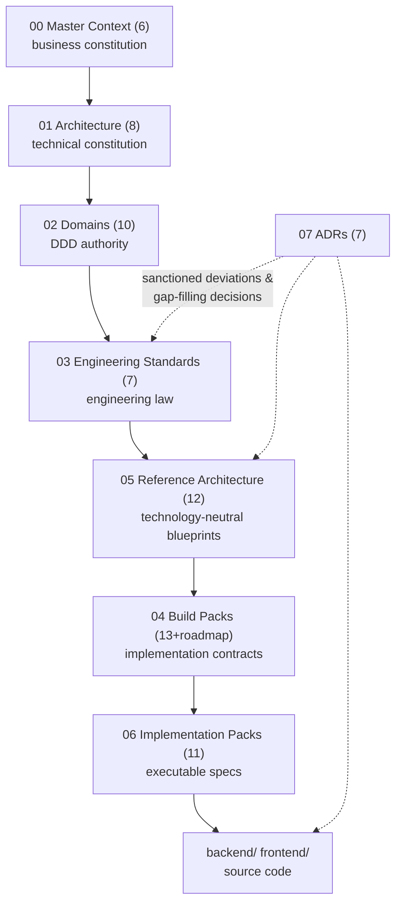
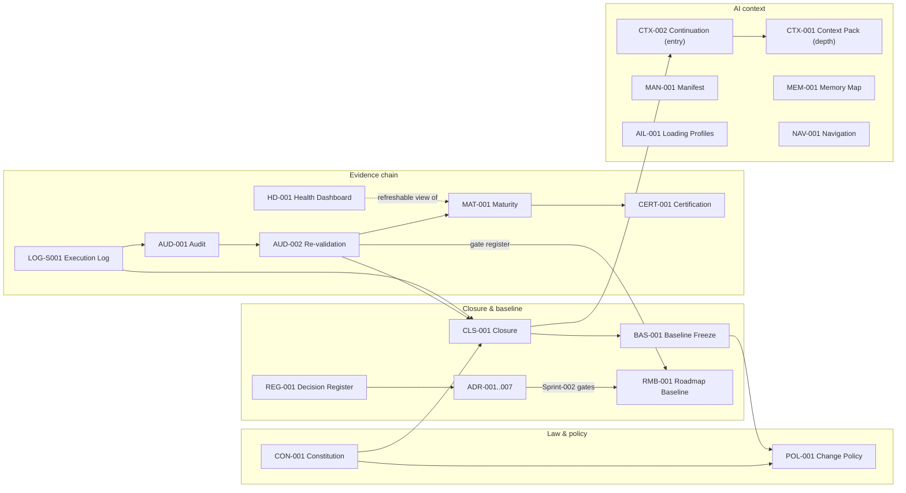
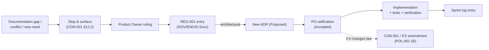

# Project ATLAS — Repository Knowledge Graph

| Field | Value |
|---|---|
| Document ID | KG-001 |
| Title | Repository Knowledge Graph — document dependency structure |
| Role | **Unique role:** the relationships *between* documents; contents live in the documents themselves. Update when a new document class is introduced, not per-document |
| Date | 2026-07-19 |

## 1. The authority spine (top-down; higher layer wins — ES-001 §5)

## 2. The governance orbit (created Sprint-001 closure; wraps the spine)

## 3. Decision flow (how a decision becomes law)

## 4. Critical dependency paths

1. **The build path (most-walked):** CTX-001 §13 mapping → IP → BP → DOMAIN → ES/RA → code. A defect here misroutes every module; this is why the *corrected* mapping in CTX-001 §13 exists and why the BP↔IP off-by-one is a registered tripwire.
2. **The gate path (Sprint-002-critical):** GOV-001 → AUD-002 gate register → ADR-002..006 → Sprint-002 plan → CLS-002 (future). If any link is skipped, Category A debt reaches production.
3. **The truth path (state):** `git log`/tag → LOG-S00x → CTX-002 → MAN-001. These four must agree; disagreement means a stage gate was skipped.
4. **The change-control path:** POL-001 → (superseding) ADR → REG-001 → BAS-00x edition. Frozen contracts (BAS-001 §Immutability 3) may only change along this path.

## 5. High-impact documents (a defect here propagates widest)

| Document | Blast radius |
|---|---|
| CON-001 | Every rule every contributor follows |
| CTX-001 (esp. §13 mapping, §15.4 trap list) | Every module routed by it; every AI session primed by it |
| ADR-001 | Every event, topic, wire format, and naming choice platform-wide |
| ES-002 / ES-003 / RA-006 | Every API envelope / every table / every event |
| BP-ROADMAP + IP-000 | All sprint/module sequencing |
| REG-001 | The index by which decisions are found at all |

## 6. Change frequency classes

| Class | Documents | Expected cadence |
|---|---|---|
| **Should rarely change** (POL-001 governed; most require ADR/PO) | MC, ARCH, DOMAIN, ES, RA · CON-001 · POL-001 · Accepted ADRs · frozen records (AUD/CLS/BAS/MAT/CERT editions — successor editions only) | Years / by exception |
| **Change at sprint close** | CTX-001, CTX-002, MAN-001, MEM-001, RMB-001, HD-001 refresh, new CLS/BAS editions | Per sprint |
| **Change continuously (living)** | Current sprint LOG, REG-001 (append-only), `07_ADRs/README.md` index | Per stage gate |
| **Change with code** | Source, lockfiles, tests | Per approved stage |
